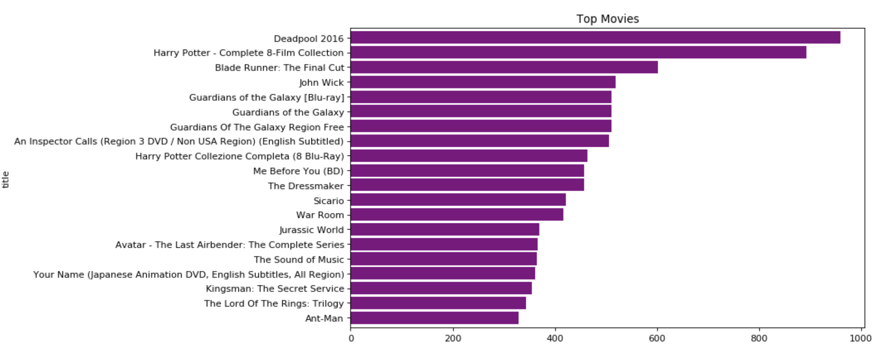

# Movie Recommender Using Deep Neural Networks

In this project, I applied keras embedding method and nueral networks to build a movies/TV recommender system with the data from Amazon reviews in 2018.

If you have any questions, please feel free to contact me:

daihongchen@icould.com

<a href="https://www.linkedin.com/in/daihong-chen-872538194/">Linkedin</a>

## Executive Summary

The project goal is to build a high performance movies/TV recommender system to engage Amazon customers, so as to drive the movies/TV products sales.

Different from other products, online entertainment products such as movies and TV, are watched by users mostly from recommendations. A high performance recommendation system that could identify the latent features of the movies and the users, so as to better personalize the recommendaded movies that are most likely interesting to each user. It is very important to attract and egage users, so as to drive sales.

Movie recommender using nueral networks has a few advantages compared to conventional approaches:

1. It is well-established that neural networks are able to deal with complex interaction patterns and precisely reflect the user’s preference.

2. Deep neural networks can efficiently learn the underlying explanatory factors and useful representations from input data.

3. Neural Collaborative Filtering is a representative work that constructs a dual neural network to model this two-way interaction between users and items.

By utilizing neural networks, the recommendation system would reach a high performance. In this study, the metrics used to evaluate the model performance is Mean Absolute Error. The final model reached 0.43 of the MAE. 

## Data

The data used in this project can be downloaded <a href="https://nijianmo.github.io/amazon/index.html">HERE</a>. The Movies and TV reviews are one of the amazon products and you can click the reviews and metadata to download the data. The website requires the user to fill a form before the download. Once you submit the form, the data will be downloaded immediately. 

Movies and TV

reviews (8,765,568 reviews)

metadata (203,970 products)

Or you can use the following codes for downloading the data:

!wget http://deepyeti.ucsd.edu/jianmo/amazon/metaFiles/meta_Movies_and_TV.json.gz

!wget http://deepyeti.ucsd.edu/jianmo/amazon/categoryFiles/Movies_and_TV.json.gz

The downloaded data files are Json.gz file. The files are unzipped  and processed using the codes in the get_data.py file. The following are some keypoints about the data.

    1. Json.gz file with 19 years data (8,765,568 reviews) 
    2. This project only uses a subsample of 2018 ratings/reviews (209,060 reviews) because of computational cost.
    3. Scrape review webpage link for each movie from the data
    4. Drop unrelated variables. Building a collaborative filtering model only requires three features of ratings, reviewerIDs, and movieIDs. Some related variables for deployment are alse selected. Others are dropped.
    5. The variables in the preprocessed dataset include: 
    'rating', 'reviewTime', 'reviewerID', 'movieID', 'style',  'reviewerName',
    'reviewText', 'summary', 'unixReviewTime', 'vote', 'category', 'title', 'main_cat',
    'description', 'brand', 'price',  'links', 'reviewer_count', 'movie_count', 
    'average_rating'
        
## Data Preparation and Exploration

1. Subsampled the data to only include 2018 reviews.
2. Clean the data. 
3. Explore the data

### Findings

1. Majority ratings are 5.
2. 50% reviewers only reviewed 1 movie.
3. 25% movies have only one review.
4. Data is sparse. The initial exploration found that more than 50% of reviewers only reviewed 1 item, and the model performance is very low. Therefore, reviews from reviewers that only reviewed 1 movie and movies that only got one review were removed. 

 

 

 

## Neural Networks Model

The movie recommender was a Collaborative Filtering model with deep learning embedding technique. Collaborative filtering model is to use similarities of users to predict the movies/TV one user has not watched/purchased, but are highly interesting to this user. It is a model based recommender.

The model applies deep learning keras embedding technique. Embedding is split one matrix into two smaller matrix, or transform high dimension to low dimensions. Embedding is one notable successful use of deep learning to represent discrete variables as continuous vectors. Embedding create a low dimensional space in which the movies that have been watched by a given user are nearby in the 'movie preference' space, and the users embeddings are closer to the movies that they have watched. These individual dimensions in these vectors typically have no inherent meaning. Instead, it’s the overall patterns of location and distance between vectors that machine learning takes advantage of. So that the model is able to recommend other movies based on those movies' proximity to a user embedding, because nearby users and movies share preferences.

 
### Base model:

1. Create the reviewer embeddings and movie embeddings as input layer.When create an Embedding layer, the weights for the embedding are randomly initialized (just like any other layer).

2. Uae Dot.product to merge two embeddings on reviewers and movies as output layer. 
    
Base model did not perform well with the loss function of Squared Mean Error as 12, and the metrics, Mean Absolute Error as 2.4.

### Final Model:

1. Create the reviewer embeddings and movie embeddings as input layer.When create an Embedding layer, the weights for the embedding are randomly initialized (just like any other layer), and are gradually adjusted via backpropagation during training.
    
2. Use concatenate to merge embedding layers: It takes as input a list of tensors, all of the same shape except for the concatenation axis, and returns a single tensor, the concatenation of all inputs (https://keras.io/layers/merge/).

3. Add hidden layers. Hidden layers that better learn the underlying factors and representations to adjust the weights via backpropagation.

4. Add dropout to help with preventing overfitting on training dataset.

Final model performs very well with the loss function of Squared Mean Error as 0.78, and the metrics, Mean Absolute Error as 0.43.

## Model evaluation: 

Metrics: MAE 

The base model only includes input and output layers. Hidden layers and dropout(help with preventing overfitting) were added in the final model.

    The MAE of the base model is 2.4.

    The MAE of final model is 0.43.

Model performance was considerably good.

### Cross validation:
    Metrics: Mean Absolute Error (MAE)
    
    StratifiedKFold, n_splits=5 
    
        0.41, 
        0.41, 
        0.38, 
        0.37, 
        0.38
        
    Average 0f MAE: 0.39
    
    Standard Deviation of MAE:  0.012

### Final model Loss (loss function: Mean Squared Error)

 

### Base model Loss (loss function: Mean Squared Error)

 

### An exaple of the recommender

 

## Conclusion

Using neural networks in recommendation system improves the performance. This model could also transfer to other products. 

The majority of the ratings are 5 starts, so the data is skewed. In the next steps, I will conduct a sentiment analysis on the reviews and use the sentiment score instead of ratings to build the model. Or combine the ratings and sentiment score as the new ratings to build the model to compare the performance. 

sources:

https://www.tensorflow.org/tutorials/text/word_embeddings

https://keras.io/layers/merge/

https://medium.com/spikelab/learning-embeddings-for-your-machine-learning-model-a6cb4bc6542e

https://medium.com/@jdwittenauer/deep-learning-with-keras-recommender-systems-e7b99cb29929
